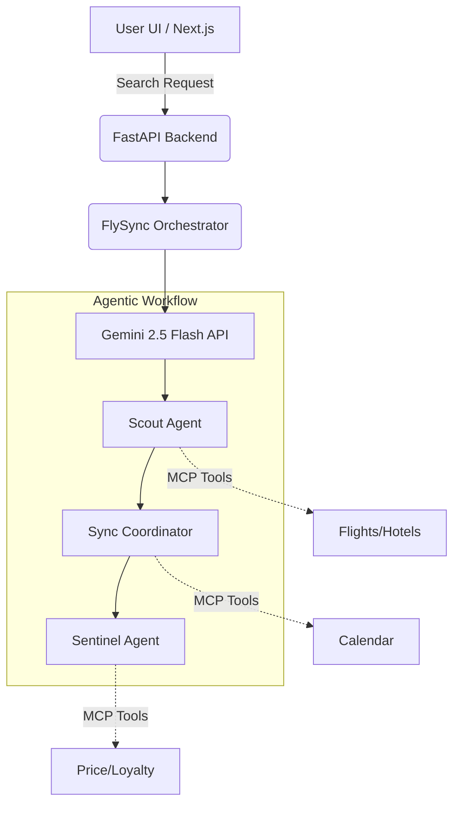

<div align="center">
  
  <h1>✈️ FlySync Hub</h1>
  <p><strong>A Premium AI-Powered Agentic Travel Concierge</strong></p>

  [](https://opensource.org/licenses/MIT)
  [](https://nextjs.org/)
  [](https://fastapi.tiangolo.com/)
  [](https://deepmind.google/technologies/gemini/)
</div>

<br />

FlySync is a state-of-the-art travel platform powered by dynamic LLM logic and Google's Gemini 2.5 Flash API. It utilizes an orchestration graph of specialized AI sub-agents to autonomously find flights and hotels, analyze pricing trends, check calendar conflicts, and apply loyalty tier perks—all while strictly enforcing your budget.

---

## ✨ Key Features

- 🤖 **Agentic Orchestration Graph**: A robust hybrid-fallback graph orchestrator managing three distinct AI sub-agents.
- 🛫 **The Scout Agent**: Aggregates, cross-references, and deduplicates flight & hotel listings, ensuring options remain within your specified budget (Smart Budget Shield).
- 📅 **The Sync Coordinator**: Checks for calendar conflicts and flags overlapping events or time-zone issues.
- 🛡️ **The Sentinel Agent**: Evaluates real-time price trends, calculates loyalty program rewards, and resolves customer support tickets autonomously.
- ⚡ **Modern Stack**: Fast, responsive frontend powered by Next.js and TailwindCSS, backed by a high-performance Python FastAPI server.

---

## 🏗️ Architecture



---

## 🚀 Getting Started

### Prerequisites
- [Node.js](https://nodejs.org/en/) (v18+ recommended)
- [Python](https://www.python.org/) (3.9+)
- A [Google Gemini API Key](https://aistudio.google.com/)

### 1. Clone the repository
```bash
git clone https://github.com/Hatim283/flysync.git
cd flysync
```

### 2. Backend Setup (FastAPI)
The backend manages the orchestration graph and LLM communication.
```bash
# Install dependencies
pip install -r requirements.txt

# Export your Gemini API Key
export GEMINI_API_KEY="your_api_key_here"

# Start the development server
uvicorn backend.main:app --reload
```
*The backend will be running at `http://localhost:8000`.*

### 3. Frontend Setup (Next.js)
The frontend provides the premium travel concierge user interface.
```bash
cd frontend

# Install Node modules
npm install

# Start the frontend development server
npm run dev
```
*The frontend will be running at `http://localhost:3000`.*

---

## ☁️ Deployment (Vercel)

FlySync is optimized for serverless deployment on Vercel. 

1. Push your code to GitHub.
2. Import the repository into your Vercel Dashboard.
3. Configure the following **Project Settings**:
   - **Root Directory**: `frontend` (Or keep it at `./` and override the build settings to build the `frontend` folder).
   - Add your `GEMINI_API_KEY` to the **Environment Variables**.
4. The included `vercel.json` ensures that all `/api/*` traffic is routed correctly to the FastAPI serverless functions.

---

## 🤝 Contributing

Contributions, issues, and feature requests are welcome! Feel free to check the [issues page](https://github.com/Hatim283/flysync/issues).

1. Fork the Project
2. Create your Feature Branch (`git checkout -b feature/AmazingFeature`)
3. Commit your Changes (`git commit -m 'Add some AmazingFeature'`)
4. Push to the Branch (`git push origin feature/AmazingFeature`)
5. Open a Pull Request

---

## 📄 License

This project is licensed under the MIT License - see the [LICENSE](LICENSE) file for details.

<div align="center">
  <sub>Built with ❤️ by <a href="https://github.com/Hatim283">Hatim283</a></sub>
</div>
