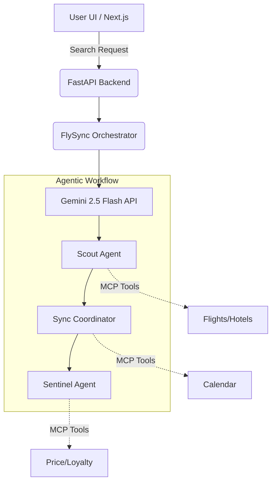

<div align="center">
  
  <h1>✈️ FlySync Hub</h1>
  <p><strong>A Premium AI-Powered Agentic Travel Concierge</strong></p>

  [](https://opensource.org/licenses/MIT)
  [](https://nextjs.org/)
  [](https://fastapi.tiangolo.com/)
  [](https://deepmind.google/technologies/gemini/)
</div>

<br />

FlySync is a state-of-the-art travel platform powered by dynamic LLM logic and Google's Gemini 2.5 Flash API. It utilizes an orchestration graph of specialized AI sub-agents to autonomously find flights and hotels, analyze pricing trends, check calendar conflicts, and apply loyalty tier perks—all while strictly enforcing your budget.

---

## ✨ Key Features

- 🤖 **Agentic Orchestration Graph**: A robust hybrid-fallback graph orchestrator managing three distinct AI sub-agents.
- 🛫 **The Scout Agent**: Aggregates, cross-references, and deduplicates flight & hotel listings, ensuring options remain within your specified budget (Smart Budget Shield).
- 📅 **The Sync Coordinator**: Checks for calendar conflicts and flags overlapping events or time-zone issues.
- 🛡️ **The Sentinel Agent**: Evaluates real-time price trends, calculates loyalty program rewards, and resolves customer support tickets autonomously.
- ⚡ **Modern Stack**: Fast, responsive frontend powered by Next.js and TailwindCSS, backed by a high-performance Python FastAPI server.
- 🌓 **Dynamic Theming**: Full Tailwind Dark & Light Mode support, seamlessly toggled via the navbar.
- 💳 **Seamless Checkout**: Smooth transition into a comprehensive Checkout Summary view for final itinerary review.

## 🤖 AI Features (GFG Build with AI)

- **Scout Agent**: Uses Gemini AI to find optimal flights and hotels
- **Sync Coordinator**: AI-powered calendar conflict resolution  
- **Sentinel Agent**: Dynamic pricing evaluation using ML models

## 🛠️ Tech Stack

- Next.js 14, TypeScript, Tailwind CSS
- Python, FastAPI
- Google Gemini AI API
- Vercel Deployment & Google Cloud Run

---

## 🏗️ Architecture



---

## 🚀 Getting Started

### Prerequisites
- [Node.js](https://nodejs.org/en/) (v18+ recommended)
- [Python](https://www.python.org/) (3.9+)
- A [Google Gemini API Key](https://aistudio.google.com/)

### 1. Clone the repository
```bash
git clone https://github.com/Hatim283/flysync.git
cd flysync
```

### 2. Backend Setup (FastAPI)
The backend manages the orchestration graph and LLM communication.
```bash
# Install dependencies
pip install -r requirements.txt

# Export your Gemini API Key
export GEMINI_API_KEY="your_api_key_here"

# Start the development server
uvicorn backend.main:app --reload
```
*The backend will be running at `http://localhost:8000`.*

### 3. Frontend Setup (Next.js)
The frontend provides the premium travel concierge user interface.
```bash
cd frontend

# Install Node modules
npm install

# Start the frontend development server
npm run dev
```
*The frontend will be running at `http://localhost:3000`.*

---

## ☁️ Deployment (Google Cloud Run + Vercel)

FlySync uses a split architecture for production: the Next.js frontend on Vercel and the FastAPI backend on Google Cloud Run.

### 1. Enable Google Cloud Services
Ensure you have the [Google Cloud CLI](https://cloud.google.com/sdk/docs/install) installed and authenticated. Then enable the necessary services:
```bash
gcloud services enable \
  run.googleapis.com \
  cloudbuild.googleapis.com
```

### 2. Deploy the Backend from Source
Run this single command inside the root of your `flysync` folder (where the `Dockerfile` is):
```bash
gcloud run deploy flysync-backend \
  --source . \
  --region us-central1 \
  --allow-unauthenticated \
  --set-env-vars="GEMINI_API_KEY=your_actual_api_key_here"
```
*(Replace `your_actual_api_key_here` with your real Gemini API key).*

### 3. Get your URL
Once the deployment finishes (it takes about 2-3 minutes to build and deploy), the terminal will output a **Service URL** that looks like this:
`https://flysync-backend-xyz.a.run.app`

### 4. Final Step: Connect Vercel to Google Cloud Run
Whichever method you choose, Google Cloud Run will give you a public URL for your backend.

1. Copy that URL.
2. Go to your **Vercel Dashboard** > Select the `flysync` project > **Settings** > **Environment Variables**.
3. Add a new variable:
   - **Key:** `NEXT_PUBLIC_BACKEND_URL`
   - **Value:** `https://flysync-backend-xyz.a.run.app` *(paste your actual Cloud Run URL here, make sure there is no trailing slash `/` at the end).*
4. **Redeploy your Vercel app** (Go to Deployments -> Redeploy) so the frontend picks up the new environment variable.

Your Next.js frontend will now seamlessly proxy all API requests to your Google Cloud Run backend.

---

## 🤝 Contributing

Contributions, issues, and feature requests are welcome! Feel free to check the [issues page](https://github.com/Hatim283/flysync/issues).

1. Fork the Project
2. Create your Feature Branch (`git checkout -b feature/AmazingFeature`)
3. Commit your Changes (`git commit -m 'Add some AmazingFeature'`)
4. Push to the Branch (`git push origin feature/AmazingFeature`)
5. Open a Pull Request

---

## 📄 License

This project is licensed under the MIT License - see the [LICENSE](LICENSE) file for details.

<div align="center">
  <sub>Built with ❤️ by <a href="https://github.com/Hatim283">Hatim283</a></sub>
</div>
