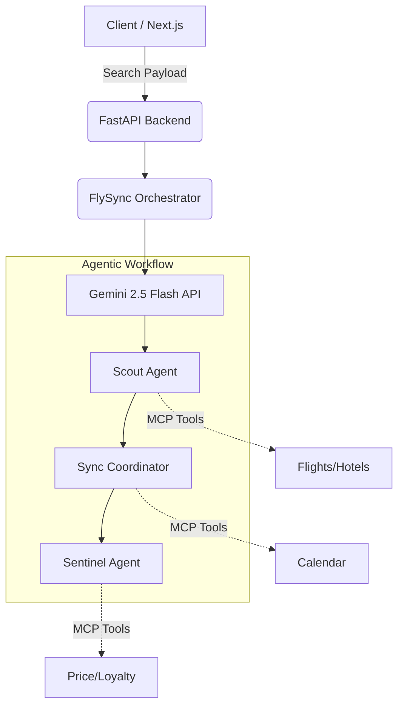

<div align="center">
  <h1>✈️ FlySync Hub</h1>
  <p><strong>A Premium AI-Powered Agentic Travel Concierge</strong></p>
  <p><em>Engineered for the GeeksforGeeks Build with AI UAE Workshop</em></p>

  [](https://opensource.org/licenses/MIT)
  [](https://nextjs.org/)
  [](https://fastapi.tiangolo.com/)
  [](https://deepmind.google/technologies/gemini/)
</div>

<br />

> **⚠️ Workshop Evaluation Note:** > FlySync Hub is a **proof-of-concept demonstration** built to showcase advanced LLM orchestration. To ensure a highly reliable and predictable evaluation experience for judges, the flight availability, hotel inventory, and dynamic pricing metrics utilize **mocked fallback data**. Our primary engineering focus was architecting the **Multi-Agent Orchestration Engine** and delivering a frictionless frontend experience, rather than connecting live, rate-limited transactional APIs.

---

## 🌟 The Vision

Modern travel planning is a fragmented logistics puzzle requiring users to manually cross-reference calendars, optimize budgets, and parse dozens of disparate booking platforms. 

**FlySync Hub** solves this through autonomous AI. Powered by Google's Gemini 2.5 Flash API, FlySync moves beyond simple conversational chatbots. It utilizes an orchestration graph of specialized AI sub-agents that collaborate in parallel to curate, optimize, and present the perfect itinerary.

## ✨ Key Features & AI Integration

- 🤖 **Agentic Orchestration Graph:** A robust hybrid-fallback orchestrator managing three distinct, parallel AI sub-agents to process complex user constraints.
- 🛫 **The Scout Agent (Inventory Engine):** Autonomously aggregates, cross-references, and deduplicates flight and hotel listings, enforcing a "Smart Budget Shield" to keep recommendations within predefined parameters.
- 📅 **The Sync Coordinator (Logistics):** Evaluates selected travel dates against simulated user schedules, intelligently flagging timezone conflicts and overlapping events.
- 🛡️ **The Sentinel Agent (Analytics):** Evaluates dynamic price trends and calculates applicable loyalty program rewards (HM Gold Member) to maximize user value.
- ⚡ **Premium UI/UX:** A high-performance frontend built with Next.js and Tailwind CSS, featuring asynchronous loading states to visually communicate backend agent activity to the user.

---

## 🏗️ Technical Architecture

FlySync relies on a decoupled architecture to isolate intensive LLM inference tasks from the client, ensuring optimal frontend performance.



### 🛠️ Tech Stack

* **AI Core:** Google Gemini 2.5 Flash API
* **Backend Orchestrator:** Python, FastAPI
* **Frontend Client:** Next.js 14, TypeScript, Tailwind CSS, Framer Motion
* **Infrastructure:** Vercel (Edge Networks) & Google Cloud Run (Containerized Backend)

---

## 🚀 Installation Instructions

### Prerequisites

* Node.js (v18+)
* Python (3.9+)
* A [Google Gemini API Key](https://aistudio.google.com/)

### 1. Backend Environment (FastAPI)

The backend manages the orchestration graph and handles all LLM communication.

```bash
# Clone the repository
git clone https://github.com/Hatim283/flysync.git
cd flysync

# Install Python dependencies
pip install -r requirements.txt

# Configure your Gemini API Key
export GEMINI_API_KEY="your_api_key_here"

# Initialize the development server
uvicorn backend.main:app --reload

```

*The backend service runs at `http://localhost:8000`.*

### 2. Frontend Environment (Next.js)

```bash
cd frontend

# Install Node dependencies
npm install

# Initialize the frontend development server
npm run dev

```

*The client application runs at `http://localhost:3000`.*

---

## 💻 Usage & Navigation

Once both servers are running, follow these steps to test the AI orchestration:

1. Navigate to the landing page and input your origin (e.g., DXB), destination, and travel dates.
2. Click **Search**. You will see the asynchronous loading modal visually indicating the states of the Scout, Sync, and Sentinel agents as they process the request via the backend.
3. Review the curated **Recommended Flight** and **AI Recommended Stay**, noting the loyalty points integration.
4. Select your preferred options and proceed to the **Checkout Summary** for a final breakdown of the itinerary.

---

## 🤝 Contributing

Contributions, optimizations, and feature requests are welcome!

1. Fork the Project
2. Create your Feature Branch (`git checkout -b feature/Optimization`)
3. Commit your Changes (`git commit -m 'Add Optimization'`)
4. Push to the Branch (`git push origin feature/Optimization`)
5. Open a Pull Request

---

## 📄 License

This project is licensed under the MIT License - see the [LICENSE](https://www.google.com/search?q=LICENSE) file for details.
