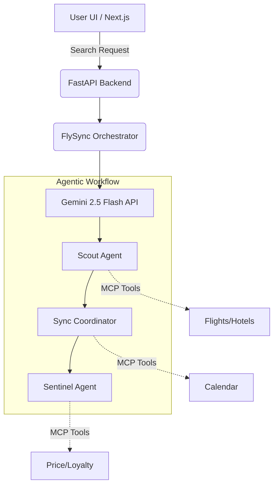

<div align="center">
  <h1>✈️ FlySync Hub</h1>
  <p><strong>A Premium AI-Powered Agentic Travel Concierge</strong></p>
  <p><em>Built for the "Build with AI" Hackathon</em></p>

  [](https://opensource.org/licenses/MIT)
  [](https://nextjs.org/)
  [](https://fastapi.tiangolo.com/)
  [](https://deepmind.google/technologies/gemini/)
</div>

<br />

> **⚠️ Hackathon Disclaimer:** 
> FlySync is a **proof-of-concept demonstration** built specifically for hackathon judging. To ensure a lightning-fast, highly reliable, and predictable experience for judges, the flight availability, hotel bookings, and pricing displayed in the UI use **mocked fallback data**. No real-time third-party booking APIs are currently connected, and no actual transactions occur. Our primary engineering focus was on building the complex **Multi-Agent Orchestration Architecture** and delivering a flawless, premium **User Experience**.

---

## 🌟 The Vision

Booking travel today is a fragmented, exhausting process of opening dozens of tabs, cross-referencing calendars, calculating loyalty points, and constantly worrying about budget constraints.

**FlySync** solves this. It is a state-of-the-art travel platform powered by dynamic LLM logic and Google's Gemini 2.5 Flash API. Instead of a simple chatbot, FlySync utilizes an orchestration graph of specialized AI sub-agents that work together to autonomously plan your perfect trip.

## ✨ Key Features

- 🤖 **Agentic Orchestration Graph**: A robust hybrid-fallback graph orchestrator managing three distinct AI sub-agents in parallel.
- 🛫 **The Scout Agent**: Aggregates, cross-references, and deduplicates flight & hotel listings, ensuring options remain within your specified budget (Smart Budget Shield).
- 📅 **The Sync Coordinator**: Checks for calendar conflicts and intelligently flags overlapping events or time-zone issues.
- 🛡️ **The Sentinel Agent**: Evaluates real-time price trends, calculates loyalty program rewards, and resolves customer support tickets autonomously.
- ⚡ **Premium UI/UX**: A fast, responsive frontend powered by Next.js and TailwindCSS, featuring smooth micro-animations and a polished checkout flow.
- 🌓 **Dynamic Theming**: Full Tailwind Dark & Light Mode support, seamlessly toggled to match user preferences.
- 💳 **Seamless Checkout**: Smooth transition from AI recommendations into a comprehensive, itemized Checkout Summary view.

---

## 🏗️ Technical Architecture

FlySync relies on a modern split architecture to handle complex AI processing without sacrificing frontend performance.



### 🛠️ Tech Stack
- **Frontend**: Next.js 14, TypeScript, Tailwind CSS, Lucide Icons, Framer Motion
- **Backend Orchestrator**: Python, FastAPI
- **AI Core**: Google Gemini 2.5 Flash API
- **Infrastructure**: Vercel (Frontend Hosting) & Google Cloud Run (Backend Hosting)

---

## 🚀 Getting Started Locally

### Prerequisites
- [Node.js](https://nodejs.org/en/) (v18+)
- [Python](https://www.python.org/) (3.9+)
- A [Google Gemini API Key](https://aistudio.google.com/)

### 1. Backend Setup (FastAPI)
The backend manages the orchestration graph and LLM communication.
```bash
# Clone the repository
git clone https://github.com/Hatim283/flysync.git
cd flysync

# Install dependencies
pip install -r requirements.txt

# Export your Gemini API Key
export GEMINI_API_KEY="your_api_key_here"

# Start the development server
uvicorn backend.main:app --reload
```
*The backend runs at `http://localhost:8000`.*

### 2. Frontend Setup (Next.js)
```bash
cd frontend

# Install dependencies
npm install

# Start the frontend development server
npm run dev
```
*The frontend runs at `http://localhost:3000`.*

---

## ☁️ Deployment Architecture

FlySync is deployed using a highly scalable, serverless approach:

1. **Google Cloud Run**: The Python FastAPI backend is containerized via Docker and deployed to Cloud Run, allowing it to seamlessly scale based on the load of incoming AI inference requests.
2. **Vercel**: The Next.js frontend is deployed on Vercel Edge Networks, proxying API requests directly to the Cloud Run backend via the `NEXT_PUBLIC_BACKEND_URL` environment variable.

---

## 🤝 Contributing

Contributions, issues, and feature requests are welcome! Feel free to check the [issues page](https://github.com/Hatim283/flysync/issues).

1. Fork the Project
2. Create your Feature Branch (`git checkout -b feature/AmazingFeature`)
3. Commit your Changes (`git commit -m 'Add some AmazingFeature'`)
4. Push to the Branch (`git push origin feature/AmazingFeature`)
5. Open a Pull Request

---

## 📄 License

This project is licensed under the MIT License - see the [LICENSE](LICENSE) file for details.

<div align="center">
  <sub>Built with ❤️ by <a href="https://github.com/Hatim283">Hatim283</a> for the Build with AI Hackathon</sub>
</div>
